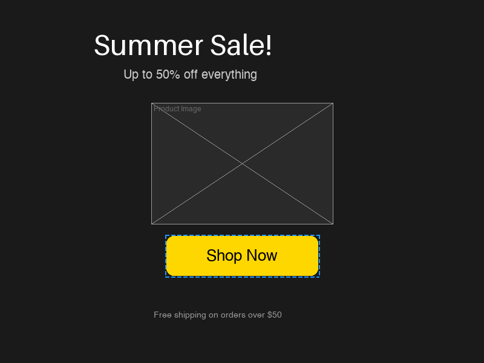

# MarketCanvas-Env

A minimalist 2D canvas RL environment for training LLM agents to design marketing assets. Exposes a standard Gymnasium interface (State, Action, Reward) and an MCP server for LLM tool-calling.


*A banner built by the scripted demo agent in 6 high-level actions.*

## Quickstart

```bash
python -m venv .venv && source .venv/bin/activate
pip install -e ".[dev]"
python demo.py          # build a banner, print reward progression, save PNG
python demo.py --all    # also run random agent contrast
pytest tests/           # 114 tests
```

## Architecture

```
elements.py      Pydantic data models (Text, Shape, Image)
    |
canvas.py        2D engine: CRUD, hit-testing, semantic serialization
    |
  +---------+-----------+
  |         |           |
reward.py  renderer.py  actions.py
  |                      |
  +----------+-----------+
             |
          env.py         Gymnasium environment (dual action/observation modes)
             |
        mcp_server.py    MCP server wrapping the environment
```

**Observation space** — dual: semantic JSON DOM (for LLM agents) + RGB pixel array (for VLM/computer-use agents).

**Action space** — two modes: high-level semantic actions (`add_text`, `move`, `resize`, ...) for MCP tool-calling, and low-level computer-use actions (`mouse_click`, `mouse_drag`, `keyboard_type`) for training agents that transfer to real interfaces.

**Reward** — heuristic scalar in [-1, 1] from three pillars: constraint satisfaction (50%), aesthetics (25%), accessibility (25%). Dense signal at every step.

## MCP Server

Connect Claude Desktop (or any MCP client) to the environment:

```json
{
  "mcpServers": {
    "marketcanvas": {
      "command": "python",
      "args": ["mcp_server.py"],
      "cwd": "/path/to/canvas_agentic_gym"
    }
  }
}
```

Available tools: `reset_environment`, `get_canvas_state`, `execute_action`, `get_current_reward`, `render_canvas`, `compare_canvas_states`.

See [examples/mcp_transcript.md](examples/mcp_transcript.md) for a transcript of Claude building a banner via MCP tool-calling.

## Project Structure

```
marketcanvas/           Core package (1,200 lines)
  elements.py             Pydantic models for canvas elements
  canvas.py               Canvas engine with CRUD and serialization
  renderer.py             PIL-based rendering to PNG
  reward.py               Three-pillar reward calculator with diagnostics
  actions.py              High-level and low-level action interpreters
  env.py                  Gymnasium environment
  prompt_parser.py        Parse target prompts into constraints
  wcag.py                 WCAG 2.1 contrast ratio utilities
mcp_server.py           FastMCP server (6 tools + 1 resource)
demo.py                 Scripted demo + random agent contrast
tests/                  108 unit tests
  test_canvas.py          Canvas CRUD, hit-testing, serialization
  test_env.py             Gymnasium reset/step, both action modes
  test_reward.py          Reward scoring, diagnostics, edge cases
  test_perturbation.py    Perturbation-based reward validation
  test_wcag.py            WCAG contrast ratio calculations
output/                 Demo PNG outputs
WRITEUP.md              Technical writeup (state/action/reward design, scaling)
```
